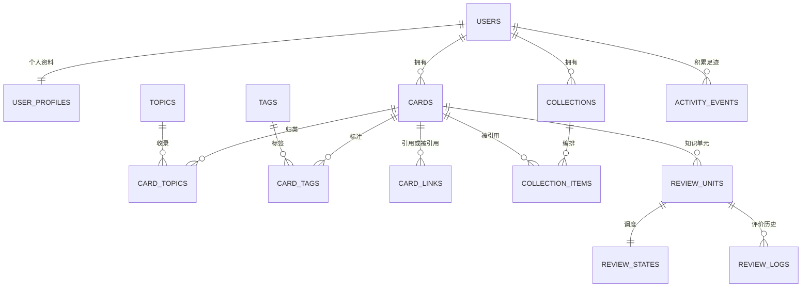

## Context

参见 [proposal.md](proposal.md)。用户于 2026-10-04 确认四张桌面 UI，并明确「现有数据库新建表，不清空」。视觉参考：[四页设计说明](../../../docs/design/card-navigation-v1/README.md)。

已核实：
- 前端为 React 19／TypeScript／Vite，页面与账号流程集中在 App.tsx，主导航仍是 Library／Connections／Atlas／Journal。
- 后端为 Python 3.13／FastAPI／psycopg，已有登录、会话、CSRF、账号设置和管理员 API；应用可托管前端构建及 SPA 回退。
- PostgreSQL 固定主版本 18；db_bootstrap 已区分 dev／prod 的 owner、migrator、app 三类角色。
- 唯一现有 SQL 为 0001_identity.sql，创建 users、auth_sessions、auth_login_throttle、account_audit、schema_migrations；另有 bootstrap 的 connection_probe。
- db_migrate 已使用有序 SQL、SHA-256、事务与 advisory lock，但应用授权目前仅特殊处理 0001；新增表不能只建 DDL 而漏授予 DML。
- 现有集成测试固定清空一次性 6179 实例的身份表。增加外键后必须更新该清理范围，避免旧测试因外键失败。
- docs 与 openspec 当前按仓库约定忽略，仅保存本地方案；本次不改变跟踪策略、不提交或推送。
- 早期重建文档提出 SQLAlchemy／Alembic／容器发布；实际已完成 change 与代码采用 psycopg／SQL 迁移和阶段化发布。本方案以实际可运行机制为基础，将差异明确写出；不在业务功能中再引入一套结构管理器。

## Goals / Non-Goals

**Goals:**
- 让已确认四页成为真实个人知识工作台；从卡片创建、整理、连接、编排到复习形成闭环。
- 共享卡片身份和关系，同时将笔记内容与学习调度分开。
- 提供可实施的页面组件、API 契约、字段类型、关系约束、索引、权限、增量迁移和验收顺序。
- 保护已有数据库和账号；通过显式事务与版本控制保证内容、关系、调度和统计一致。

**Non-Goals:**
- 公开主页、跨用户分享、关注、实时协作、Anki 文件兼容、旧系统数据导入、附件与图片上传。
- 永久清除用户内容、生产库清空重建、自动结构回退、数据库启动时迁移。
- 第一版训练个性化复习模型；仅引入普通 FSRS 调度包，不引入 optimizer 的训练依赖。
- 规划阶段不修改业务源码或执行数据库操作；用户随后明确“开始执行”时，按 tasks 实施并验证，现有数据库增量建表保留数据，生产发布另行授权。

## Decisions

### 1. 应用整体结构

继续使用 React／TypeScript／Vite → 同源 /api → FastAPI → PostgreSQL 18。
前端增加 React Router 的客户端路由和 TanStack Query 的服务端数据管理；沿用 CSS 建立统一设计变量及组件，不引入整套 UI 组件库。后端使用同步 psycopg、参数化 SQL 与显式业务服务，不引入 ORM。理由：既有账号代码和迁移已采用此方式，第一版关系规模适中，复合外键和事务需要清晰可审查的 SQL。

备选是引入 SQLAlchemy／Alembic；暂不采用，因为会同时增加已有身份表映射、迁移基线接管和权限重建任务，无法为当前四页直接带来同等收益。若未来采用，必须作为独立变更迁移历史管理，而非两套并行。

前端计划结构：

```text
src/
  app/                 路由、会话上下文、查询客户端
  components/          AppShell、TopNav、MobileNav、Card、Tag、Dialog、PageState
  features/cards/      两类编辑器、列表、详情、分类标签与回收站
  features/knowledge/  队列、答案揭示、复习评分
  features/opinions/   引用选择、链接与反向链接
  features/collections/合集列表、目录、排序、阅读器
  features/profile/    资料、统计、活动日历与置顶
  lib/                 API 客户端、时间处理、安全 Markdown 与稳定引用
  styles/              设计变量、布局与基础样式
```

后端新增 routers、schemas、services、repositories 分层目录，认证仍复用 auth.py 的依赖：
路由解析／授权 → Pydantic 校验 → 业务服务与事务 → 按 owner_id 查询的 SQL 仓储。
纯调度和填空解析独立模块便于测试。不要为了分层先整体重写已运行的认证代码。

### 2. 路由、四页布局与状态

| URL | 页面与布局 | 关键交互 |
| --- | --- | --- |
| /knowledge | 分类侧栏、复习摘要、搜索、知识卡网格 | 问答／填空、收藏、卡片详情、开始复习 |
| /knowledge/cards/:id | 知识详情 | 显示答案、编辑、来源及关系 |
| /knowledge/review | 专用学习界面 | 主动回忆、答案、四档评价、进度 |
| /opinions?card=:id | 主题侧栏、观点列表、选中详情 | 稳定编号、正文引用、关联、反向链接 |
| /collections/:id?view=read&item=:itemId | 合集侧栏、目录／单卡阅读器 | 引用成员、排序、上一张／下一张 |
| /me | 个人主页 | 资料、积累、近期活动、七天周日历、置顶 |
| /new?type=knowledge&format=qa | 新建页／编辑面板 | 三种对象；知识有问答和填空 |
| /settings、/admin/users、/trash | 辅助页 | 保留账号操作、管理员权限、可恢复删除 |

根路径导向 /knowledge；搜索、筛选、排序、选中卡片及阅读成员写入 URL。
移动端使用四个底部导航与中央新建入口；观点详情切为独立可返回视图。
学习区和卡片阅读支持左右键；空格仅在非输入区域触发答案揭示，不能劫持编辑器。

统一米白背景 #f5f5f0、墨绿 #17201d、细网格、低饱和绿色、少量陶土色标签；
标题 32–40px，正文 14–16px，卡片间距 16px，圆角 10px，触控区至少 44px。
将效果图中略有差异的 Logo、顶部尺寸、头像与边框归一为组件；默认使用系统中文字体，无需运行时外部字体网络请求。活动日历每周必须七格。

每页具备加载、真实空数据、错误重试；401 统一进入登录态，退出或切换账号清除查询缓存。
编辑失败保留内容；离开未保存表单时提示；不将个人正文或会话存入 localStorage。
缓存键必须带当前 user_id；已登出的请求取消，延迟返回结果不得恢复旧账号内容。
新建请求生成并复用 client_request_id，网络重试返回已有对象；请求数据改变时生成新标识。

### 3. 卡片、填空与引用的统一模型

统一 cards 主表，kind=knowledge|opinion。知识 form=qa|cloze；观点 form=NULL。
QA 使用 question_md 与 answer_md；cloze 和 opinion 使用 body_md。CHECK 约束限制每种类型的字段组合；格式及 kind 创建后不可切换。此选择比两套笔记表更容易保证合集、搜索和链接的统一身份，且第一版只有三种内容组合。

content 的格式边界：title 1–200 字符；单段 Markdown 最多 64 KiB UTF-8；标签名 1–32、主题名 1–80；单卡最多 20 标签、10 主题，知识主题最多 1；来源标题最多 200、定位最多 200、URL 最多 2048，只接受 http(s)。数据请求不接受 owner_id，Pydantic extra=forbid。

ID 为应用生成 UUID；可读编号为创建日期与 UUID 的短前缀，例如 20261004-3F8A91C2，遇同一用户编号冲突重试扩长，永不依赖日期下的 count+1。编号创建后不变，移动时区不改变身份。
未整理使用 processing_state=inbox|organized，与 lifecycle=active|archived|trashed 独立，不能用多个真假开关表达多状态。
card 的 is_bookmarked 是真正二值收藏标记；来源为 source_title、source_url、source_locator。

填空采用 {{c1::答案::可选提示}}，编号 1–99，单卡最多 20 个不同编号，不支持嵌套。
相同编号的多个片段共同遮蔽，其他编号展示完整内容。QA 单元编号 0。
填空答案使用纯文本，正文其余部分可 Markdown；解析时忽略代码块中的标记，错误括号、空答案和没有有效编号返回 422。
单元按 (card_id, cloze_index) 稳定定位；卡片正文改变增加卡片 revision，保留仍存在单元状态，删除单元停用，重新加入旧编号则重置新学习状态但不删除历史。

正文引用规范写入 [[UUID|显示文本]]；用户从搜索选择器选定目标后插入稳定 UUID，阅读展示目标的当前标题。
未解析 [[标题]] 保留文本并提示选择目标，不根据同名标题随意链接。
同步解析跳过代码块。card_links 按 inline／manual 分别记录，编辑正文只更新 inline 关系；统计与显示按目标去重。
自链接在 API 与数据库拒绝；其他用户或无效稳定 UUID 拒绝，事务不能部分成功。
归档／回收站引用展示不可用提示，不显示正文；恢复重新生效。

Markdown 禁用原始 HTML、危险 URL 和远程图片加载；使用成熟的安全 AST 渲染，不自行做正则 HTML 清理。正文仅存原始 Markdown，不存浏览器生成 HTML。

### 4. 数据库实体与字段

以下为 DDL 设计，实际 CREATE TABLE 文件在实施阶段生成。全部新增对象位于 app schema；UUID 使用应用生成值，不依赖额外 UUID 扩展。
除 users.id 外，所有关系引用可用的 (owner_id,id) 唯一键；kind 专属关系进一步带 kind。
所有计数非负、revision/version >=1，时间使用 timestamptz，服务端统一传 UTC。下表中 NN 表示 NOT NULL。

| 表 | 主要字段及约束 | 用途 |
| --- | --- | --- |
| user_profiles | user_id uuid PK/FK users；display_name varchar(80) NN；bio text NN 默认空；avatar_color text NN；interests text[] NN 默认空；timezone varchar(64) NN 默认 Asia/Shanghai；daily_new_limit smallint NN 默认20（0–100）；daily_review_goal smallint NN 默认20（1–1000）；revision integer NN 默认1；created_at/updated_at | 个人资料与时区、学习目标；interest 最多8项每项32字符 |
| cards | id uuid PK；owner_id uuid FK users NN；code varchar(48) NN；kind text NN；form text；title varchar(200) NN；question_md/answer_md/body_md text；source_title/source_url/source_locator text；processing_state text NN 默认inbox；lifecycle text NN 默认active；trashed_at timestamptz；is_bookmarked boolean NN 默认false；search_text text NN；revision integer NN 默认1；client_request_id uuid NN；creation_request_digest char(64) NN；created_at/updated_at | 两类内容共用主表；UNIQUE(owner_id,id)、UNIQUE(owner_id,id,kind)、UNIQUE(owner_id,code)、UNIQUE(owner_id,client_request_id) |
| topics | id uuid PK；owner_id FK users NN；kind text NN knowledge/opinion；name varchar(80) NN；position integer NN >=0；created_at | 知识分类和观点主题；UNIQUE(owner_id,id,kind)、UNIQUE(owner_id,kind,name) |
| card_topics | owner_id uuid NN；card_id uuid NN；topic_id uuid NN；card_kind text NN；PK(owner_id,card_id,topic_id) | 复合 FK 同时对齐卡片／主题的 owner_id 和 kind；knowledge 对 (owner_id,card_id) 建唯一部分索引 |
| tags | id uuid PK；owner_id FK users NN；name varchar(32) NN；created_at；UNIQUE(owner_id,id)、UNIQUE(owner_id,name) | 两类卡片共享标签；名称保存前 trim／NFKC 归一 |
| card_tags | owner_id/card_id/tag_id uuid NN；PK(owner_id,card_id,tag_id) | 两端复合 FK，避免跨用户关系 |
| card_links | owner_id/source_card_id/target_card_id uuid NN；origin text NN inline/manual；created_at；PK(owner_id,source_card_id,target_card_id,origin)；CHECK(source!=target) | 两端复合 FK；保留正文和手动不同来源 |
| collections | id uuid PK；owner_id FK users NN；title varchar(200) NN；description_md text NN 默认空；cover_style text NN；cover_color text NN；is_favorite/is_pinned boolean NN 默认false；lifecycle text NN active/trashed；trashed_at；revision integer NN 默认1；client_request_id uuid NN；creation_request_digest char(64) NN；created_at/updated_at；UNIQUE(owner_id,id)、UNIQUE(owner_id,client_request_id) | 私有合集，收藏指本人合集；封面使用内置矢量样式 |
| collection_items | id uuid PK；owner_id/collection_id/card_id uuid NN；position integer NN >=0；created_at；UNIQUE(owner_id,collection_id,card_id)；UNIQUE(owner_id,collection_id,position) DEFERRABLE INITIALLY DEFERRED | 只引用原卡片；卡片／合集复合 FK，删除成员不删卡片 |
| review_units | id uuid PK；owner_id/card_id uuid NN；card_kind text NN 固定knowledge；cloze_index smallint NN 0–99；is_active boolean NN 默认true；created_at/updated_at；UNIQUE(owner_id,id)、UNIQUE(owner_id,id,card_id)、UNIQUE(owner_id,card_id,cloze_index) | 复合 FK 引用 cards(owner_id,id,kind)，数据库直接排除观点；form 与编号的一致性由服务验证 |
| review_states | owner_id/unit_id uuid NN；PK(owner_id,unit_id)；state text NN new/learning/review/relearning；due_at timestamptz NN；last_reviewed_at timestamptz；review_count/lapse_count integer NN 默认0；scheduler_payload jsonb NN；scheduler_version varchar(80) NN；version integer NN 默认1 | 独立调度，复合 FK 引用复习单元；时间／状态索引字段与调度 JSON 在同一事务同步 |
| review_logs | id uuid PK；owner_id/unit_id/card_id uuid NN；request_id uuid NN；request_digest char(64) NN；rating smallint NN 1–4；reviewed_at timestamptz NN；duration_ms integer NN >=0；content_revision integer NN；state_version_before integer NN；scheduler_version varchar(80) NN；state_before/state_after/content_snapshot jsonb NN；response_payload jsonb NN；UNIQUE(owner_id,request_id) | 只追加的历史、重试响应和内容快照；复合 FK (owner_id,unit_id,card_id) 引用 review_units(owner_id,id,card_id)，数据库保证单元与卡片一致 |
| activity_events | id uuid PK；owner_id FK users NN；card_id/collection_id uuid 可空；event_kind text NN card_created/card_updated/card_organized/reviewed/collection_created/collection_updated；entity_title varchar(200) NN；occurred_at timestamptz NN | 卡片／合集复合 FK；CHECK 限定事件目标：卡片事件有且仅有 card_id，合集事件有且仅有 collection_id；事务内写入 |

13 张新增业务表；已有身份表全部保持原样。
profiles 仅通过数据迁移回填现有用户，不修改 users；新注册与管理员创建账号事务同时创建 profile。
外键删除策略默认 RESTRICT，第一版没有永久删除用户或卡片；删除主题／标签仅在无引用时允许，合集移回收站保留所有成员。
collection_items 的移除是显式 DELETE，服务删除成员并重排连续位置，增加合集 revision。
生命周期 CHECK 要求 trashed 时 trashed_at 非空，其余为空；还原保留原 ID。
profile 的 IANA 时区由服务校验，不尝试用数据库 CHECK 读取时区目录。

布尔值跨层保持同一命题：SQL／JSON 使用 is_bookmarked、is_favorite、is_pinned、is_active，TypeScript 请求类型保留 snake_case；true 均表示“已收藏／已置顶／可用”。已有 users.is_active 不改名。多状态字段明确使用枚举式 text+CHECK，不拆成相互冲突的布尔列。

关系概览：



### 5. 数据库约束、索引与权限

跨表所有者一致性使用复合外键，不通过读取其他表的 CHECK 实现；PostgreSQL 对跨表完整性使用 FOREIGN KEY 而非 CHECK，参见 [约束文档](https://www.postgresql.org/docs/18/ddl-constraints.html)。

新增索引：
- cards(owner_id,kind,lifecycle,updated_at DESC,id DESC)、cards(owner_id,processing_state,updated_at DESC)，正常收藏部分索引；code 唯一索引用于编号查找。
- card_topics(owner_id,topic_id,card_id)、card_tags(owner_id,tag_id,card_id)，知识归类唯一部分索引。
- card_links(owner_id,target_card_id,source_card_id) 支持反向链接；主键支持正向链接。
- collections(owner_id,lifecycle,updated_at DESC,id DESC)，正常置顶部分索引；collection_items 合集顺序唯一键及 (owner_id,card_id) 反向关系。
- review_states(owner_id,state,due_at,unit_id)；review_units(owner_id,card_id)；review_logs(owner_id,reviewed_at DESC,id DESC)。
- activity_events(owner_id,occurred_at DESC,id DESC)。

第一版中文搜索使用参数化 ILIKE（转义 %、_ 和反斜线）匹配 search_text，必要 GIN trigram 索引使用 PostgreSQL 内置 pg_trgm，参见 [pg_trgm 文档](https://www.postgresql.org/docs/18/pgtrgm.html)。
search_text 拼接编号、标题、问题、答案、正文和来源；由服务与 cards 更新同事务维护。结果先约束 owner_id、类型和 lifecycle，不按图片中的示例数返回。
扩展安装至 public，索引使用 public.gin_trgm_ops；迁移前检查扩展可用和 namespace。若已有扩展在其他 schema，不静默移动，停止并报告兼容问题。owner 在目标库安装，app 无需扩展管理权限。
一／二字关键词仍支持 ILIKE，可能顺序扫描；第一版面向个人规模，接受这个边界，不引入 Elasticsearch。以真实中文短词和千张卡片做查询演练并记录 EXPLAIN。

授权清单按迁移版本显式定义：
- user_profiles、cards、collections、review_units、review_states：SELECT/INSERT/UPDATE。
- topics、tags、card_topics、card_tags、card_links、collection_items：SELECT/INSERT/UPDATE/DELETE（仅对应显式组织操作）。
- review_logs、activity_events：SELECT/INSERT；历史不向 app 开放 UPDATE/DELETE。
- 继续拒绝 app 的 DDL、TRUNCATE、owner 成员权限和 schema_migrations 访问。
不要使用 ALTER DEFAULT PRIVILEGES 将所有未来表一并暴露，也不要用 GRANT ALL。
API 所有查询以会话 owner_id 过滤；复合外键提供关系隔离，不声称普通应用连接自身具备行级读取隔离。第一版无需 RLS，必须用双用户 API 测试覆盖读取、计数和写入越权。

### 6. API 契约与事务

沿用同源 Cookie、current_user、可信 Origin 和 X-CSRF-Token。新的 GET 全部需认证；POST/PATCH/PUT/DELETE 增加来源及 CSRF 校验。管理员也只能用自己的 owner_id 操作卡片。

列表返回 {items,total,limit,offset}；limit 默认24、最大100；offset>=0。支持 kind、q、topic_id、tag_id、lifecycle、processing_state、is_bookmarked、sort。sort 仅接受固定枚举 updated_desc／created_desc／code_asc，稳定排序包含 id；分页为当前查询快照，翻页期间并发更新后主动刷新列表。

| 方法／路径 | 请求与返回要点 |
| --- | --- |
| GET/POST /api/cards | 查询列表／创建类型化内容；创建带 client_request_id，不接受 owner_id |
| GET/PATCH /api/cards/{id} | 完整详情／带 expected_revision 编辑内容与组织字段；PATCH 返回新 revision |
| POST /api/cards/{id}/lifecycle | {action:archive/restore/trash,expected_revision}；restore 回到active |
| GET /api/cards/summary | 类型数量、分类数量、待整理与收藏数量；在 /{id} 动态路由前注册 |
| GET/POST /api/topics、/api/tags | 本人分类标签；列表按 kind 或 name 查询 |
| PATCH/DELETE /api/topics/{id}、/api/tags/{id} | 重命名／未被引用时删除；409 说明仍在使用 |
| GET /api/cards/{id}/links | 正向与反向的去重目标、来源及可用状态 |
| POST/DELETE /api/cards/{id}/links/{target_id} | 添加／删除 manual 来源；带 expected_revision；正文关系由编辑自动同步 |
| GET /api/reviews/queue | 过滤分类，返回到期／额度内新单元、当前卡片修订、state_version；最多100个 |
| GET /api/reviews/summary | 到期单元、新单元、今日评价数、已掌握内容卡及学习目标 |
| GET /api/reviews/units/{id}/preview | 当前版本下四档预计间隔；纯计算，不写历史 |
| POST /api/reviews/units/{id}/ratings | {request_id,rating,expected_state_version,expected_content_revision,duration_ms} |
| GET/POST /api/collections | 列表含总成员、可用成员、知识／观点数量；创建带client_request_id |
| GET/PATCH /api/collections/{id} | 详情／资料、收藏、置顶；使用expected_revision |
| POST /api/collections/{id}/lifecycle | trash/restore、expected_revision；回收站保留成员 |
| GET/POST /api/collections/{id}/items | 目录／批量添加本人卡片；添加带expected_revision |
| DELETE /api/collections/{id}/items/{item_id} | 移除引用并整理顺序；带expected_revision |
| PUT /api/collections/{id}/order | {item_ids:[完整成员列表],expected_revision} |
| GET/PATCH /api/me/profile | 读取／编辑资料；PATCH带expected_revision |
| GET /api/me/summary | 知识／观点／合集数量、连续天数 |
| GET /api/me/activity | 最近活动，按 kind 过滤和分页 |
| GET /api/me/heatmap | 十二周日历，返回 timezone、起止日期、每天计数 |
| GET /api/me/pinned-collections | 最多6个有效置顶合集入口 |

错误采用 HTTP 401未认证、403来源／CSRF、404对象不可用、409修订／重复／使用中、422输入无效、503数据库不可用。新业务错误固定包含 code、message、可选 field_errors／current_revision，不回传 SQL、其他用户身份或 DSN；旧认证 detail 格式由统一前端客户端兼容。

卡片创建事务：卡片→主题标签→正文引用→复习单元与状态（知识）→活动记录；任何阶段失败全部回滚。重试先查本人 client_request_id，规范化请求载荷对比不可变 creation_request_digest，匹配返回已创建对象，不匹配返回409，不覆盖已有对象；后续编辑不改变创建摘要。并发同键创建遇唯一冲突时回滚本事务后读取已提交对象再比较摘要。合集创建采用相同规则；客户端同一新建请求在收到结果前不得换标识。

编辑事务：按 owner_id/id/expected_revision 原子更新→替换组织关系→同步 inline 链接→同步单元→活动→提交。对内容及组织变更统一增加卡片 revision；正文／问题／答案实质变化记录card_updated，只有主题／标签／手动链接／收藏变化记录card_organized，不产生学习事件。完全无变化的保存不写活动。
主题／标签重命名不改变卡片 revision，但影响显示；删除关联必须走卡片编辑事务。

重排事务：锁本人 collection 行、核对 revision 和完整 item 集，更新 deferred 唯一位置→合集 revision→活动→提交。成员列表包含暂不可用卡片；只在阅读时过滤，不因隐藏卡片丢失恢复位置。
锁顺序统一为先卡片／合集、再按 ID 排序的单元／状态；评价与编辑采用同序，避免死锁。

### 7. 学习调度与统计口径

知识使用 Python 普通 fsrs 包，由封装适配器序列化调度状态；备选自写间隔算法会增加算法正确性和长期状态兼容风险，因此采用成熟实现。来源：[py-fsrs 官方仓库](https://github.com/open-spaced-repetition/py-fsrs)。
应用锁定依赖版本，使用 UTC、四档评价，禁用随机间隔扰动以便重复计算；初始目标保留率0.9。
持久化 library 版本与应用适配器版本，JSON 存完整 scheduler/card 状态；state/due_at 为查询投影，服务测试保证与 JSON 一致。不暴露优化器、不安装 fsrs[optimizer]；版本升级另做兼容与重放演练。

评价事务先查 (owner_id,request_id) 幂等记录；命中且规范载荷摘要相同直接返回已存结果，摘要不同409。
随后锁 card、unit、state 并重查幂等键；验证 lifecycle、is_active、内容 revision 与 state version。同键并发提交到不同单元时，唯一键冲突回滚全部写入，再独立读取原记录比较摘要，返回原结果或409。
服务端当前UTC时间和固定调度参数生成下一状态，原子写 state、review_log、activity_event。state_before/state_after保存应用状态、版本与完整scheduler快照，支持准确判断首次学习及历史重放。
单元刚创建时 state=new，scheduler_payload 可含库的初始 learning 状态；第一次评价后映射 learning/review/relearning。恢复删除的编号重置时增加version，旧请求不可继续。
duration_ms 仅用于体验分析，限定0–3600000，不作为客户端控制实际复习时间的通道。

队列排序：已学习且 due_at<=now 的单元优先，再取仍在每日新额度内的 state=new；新额度按本人时区当日首次评价的不同单元数扣减。
已到期 learning/relearning 必须可重新出队；前端本轮列表不断补入已到期重新学习单元，没到期时显示等待时间，不计作永远完成。
学习界面本轮进度只表示当前批次已提交评价，服务器今日摘要用于跨刷新统计。第一版不保存独立 study_session。
复习过程可以刷新后从新队列继续，不恢复未提交评价。

计数明确：
- 主页积累统计正常和归档内容，排除回收站；知识按 cards 而非 units。
- 知识页待复习统计正常、活跃、已学习且到期的 units，单元数量明确标注。
- 新单元为 state=new；今日完成为当日本人成功评价的不同单元数；进度文案为「今日已复习 X / 目标 Y」，不照搬效果图的演示6/12。
- 「已掌握」是产品指标，不宣称科学定论：某正常知识卡具有至少一个活跃单元，且所有活跃单元处于review，每个 last_reviewed_at 到 due_at 的间隔>=21天。
- 未评分的浏览／显示答案不计学习；创建、正文修改和成功评价计学习足迹；纯标签、收藏、合集排序只计近期活动。
- 热力图只取card_created／card_updated／reviewed三种学习事件，按本人时区聚合十二周；card_organized与合集事件不计学习足迹。每周七天，未来日期不可点；当天无学习则从昨天开始向前算连续天数。
- 修改时区即以原始UTC事件重新聚合。资料统计合并读取，不逐卡发请求。

### 8. 合集阅读与个人页面

合集用 collection_items 引用实体。封面为内置 curve／lines／radial 样式和 sage／clay 色；
「收藏」为本人合集的 is_favorite；置顶最多6个，置顶动作锁 profile 行串行检查，避免并发越过上限。
阅读器维护当前 item_id，而不是仅保存数组下标。顺序按position；随机在当前阅读会话生成排列并保存在内存，前进后退不重新随机；刷新建立新的随机顺序并尽量保留当前有效item_id。
移除当前成员后选原位置的后继，无后继则前驱；无有效成员展示空状态。
目录展示隐藏原因和总成员数，阅读页码仅计算 active 可用成员；每次切换卡片重置答案状态。
填空卡在合集仅作为整张正文浏览：默认全部填空遮蔽，展开后全部答案可见；只有专用学习流程按编号逐单元调度。

个人主页默认显示名为 username，avatar_color 默认sage，兴趣为空；不改登录用户名。
资料、置顶、概要、活动和日历可并行请求，各区局部失败单独重试；数量均来自数据库。
编辑 profile 使用其 revision。近期活动的 entity_title 为发生时快照；回收站事件可显示文本但不可跳转正文。回收站账号内容不硬删，因此关系保留且不泄露其他用户信息。

## Risks / Trade-offs

- [SQL 主表允许错误字段组合] → kind/form/lifecycle 用命名 CHECK、内容非空与字节大小检查，并用复合外键与API双重校验；跨表格式规则放服务测试。
- [中文短词难以获得理想索引计划] → 小规模先保留ILIKE正确性，增加trigram与明确查询演练；不提前引入外部搜索服务。
- [新增表没有DML授权，迁移成功但API失败] → 版本化授权清单与app身份端到端测试，授权和迁移记录一起提交。
- [旧测试只清理users造成外键冲突] → 显式补齐隔离测试全部业务表清理，先校验实例身份；不允许生产测试 DSN。
- [重复评分、并发编辑或重排覆盖数据] → 内容与学习状态分别版本控制，幂等键、事务锁和409可恢复反馈。
- [FSRS版本更新后状态不可读] → 锁版本、保存适配器版本及快照，升级前兼容演练；用户界面不将库内部字段当永久契约。
- [旧原型规格仍要求新建只能占位] → 本change明确接续并替代旧占位行为；实施更新相关说明，但不擅自归档旧change。
- [个人记录快照保留已回收内容] → 历史只在本人可见；第一版可恢复删除不等同彻底擦除，彻底删除需要后续独立设计。
- [原文档与实际栈不一致] → 实施维护说明以本方案和实际代码更新，未来工具替换独立变更。

## Migration Plan

### 迁移文件和单一结构来源

| 顺序 | 文件 | 内容 |
| --- | --- | --- |
| 已有 | 0001_identity.sql | 原文件保持字节不变；身份、会话与迁移历史 |
| 新增 | 0002_card_workspace.sql | profiles、cards、topics/card_topics、tags/card_tags、card_links、collections/items、activity_events，共10表；pg_trgm与索引；profiles已有账号回填 |
| 新增 | 0003_knowledge_review.sql | review_units、review_states、review_logs，共3表；复合FK、时间索引 |
| 同步代码 | db_migrate 的版本授权清单 | 0002/0003所需DML精确授权；历史全量预检与重复执行验证 |

编号基于当前仅有0001；实施前若其他change已占用0002，采用下一连续编号并更新全部引用，绝不覆盖。
数据库主结构唯一来源为版本迁移 SQL；全新数据库先bootstrap再执行0001→0002→0003，已有数据库仅补0002→0003。
不添加独立“最新全量建表.sql”、不生成DROP／TRUNCATE重建脚本，不修改现有账号。

0002回填通过 INSERT INTO app.user_profiles ... SELECT id, username ... FROM app.users 形成默认资料；
profile仅在对应用户不存在资料时插入，不覆盖后来编辑的数据。新业务卡片表保持空，没有演示卡片或默认兴趣。
迁移与DDL、回填、授权、schema_migrations记录保持每版本同事务；0003失败时0002可保留完整提交状态，重跑从缺失版本继续。
迁移运行前核验完整已应用版本与所有文件checksum，历史缺失／篡改先失败，再应用任何待执行版本；同一运行使用明确锁策略串行，不能边应用新版本边发现历史已损坏。
应用启动只读取数据，不自动迁移。

### 实施与演练次序

1. 在现有uv虚拟环境和锁文件中补普通业务依赖；准备一次性PostgreSQL 18实例（沿用测试专用6179）。
2. 编写0002/0003、版本授权和必要验证，并更新身份集成测试的显式清理表列表。
3. 演练空库bootstrap+全部迁移；建立含账号、会话、限流、审计的0001基线，再升级；核对原数据快照、哈希与账号ID完全不变。
4. 对已有库重跑确认无变化；核对schema、索引、FK、CHECK、约束延迟、权限与空库最终一致。
5. 验证篡改／缺失历史、授权故障、中途失败、并发迁移；故障只在隔离库制造。
6. 完成API单元及双用户集成测试，再实现四页及关键浏览器闭环；构建并确保SPA深链接由API正确回退。
7. 检查发布包包含全部历史和新增SQL；沿用Stage→备份并检查可恢复性→Migrate→Activate，成功标记与同一包SHA绑定。
8. 规划阶段不连接实际库；用户明确实施后可执行本地 dev 增量迁移。正式生产库迁移仍需要发布授权与核对目标环境后单独执行。

### 失败恢复与兼容

新表采用追加方式，旧应用和0001身份功能保持兼容；旧应用可继续运行而不访问新业务表。
单个迁移失败由事务回滚，已完成版本不回退；重试使用相同不可变文件。
激活失败恢复上一应用构建；数据库维持已提交新增结构。需要修复结构时新增前向迁移，不自动删除业务表或恢复覆盖当前数据。
上线验收包含旧登录／会话／管理员、新卡片创建与编辑、双向链接、合集翻阅、评分与主页计数。

## References

- [React Router 官方安装与客户端路由](https://reactrouter.com/start/declarative/installation)
- [TanStack Query 官方服务端状态说明](https://tanstack.com/query/latest/docs/framework/react/overview)
- [PostgreSQL 18 约束](https://www.postgresql.org/docs/18/ddl-constraints.html)
- [PostgreSQL 18 pg_trgm](https://www.postgresql.org/docs/18/pgtrgm.html)
- [py-fsrs 官方实现与状态序列化](https://github.com/open-spaced-repetition/py-fsrs)

库的具体补充版本在实施时按Python 3.13和现有锁文件验证后锁定；不以本文链接的动态版本代替锁文件。
